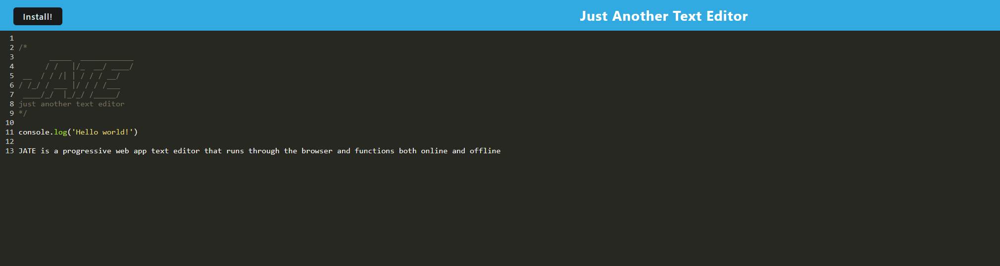

# Just Another Text Editor

Link To Deployed App:
>[J.A.T.E.](https://morning-shelf-20480-d6c36316ee54.herokuapp.com/)

## Description

This progressive web app is a text editor that runs in the browser and functions both online and offline.
Users can install JATE to the local system and take notes with JavaScript syntax highlighting.

## Table of Contents

- [Description](#description)
- [Installation](#installation)
- [Usage](#usage)
- [License](#license)
- [Questions](#questions)

## Installation

1. Clone this repo onto your system

2. Run `npm install` to install all dependencies

3. Run `npm run build` to build the dist folder

4. Run `npm start` to start the app using the compiled dist folder

### To Run in Dev Mode

1. Clone this repo onto your system

2. Run `npm install` to install all dependencies

3. Run `npm run start:dev` to start the app in dev mode

## Usage

This PWA can be used as a text editor on your local system allowing users to take notes with JavaScript syntax highlighting.
To install the PWA locally simply click the Install button in the browser page or the installation icon on the right side of the url bar.

## License

This project is under the license of MIT.

## Questions

GitHub account:

>[https://github.com/HunterMuratore](https://github.com/HunterMuratore)

Reach me through email here to ask any questions about the app!

>Email: [muratoreh@gmail.com](mailto:muratoreh@gmail.com)
